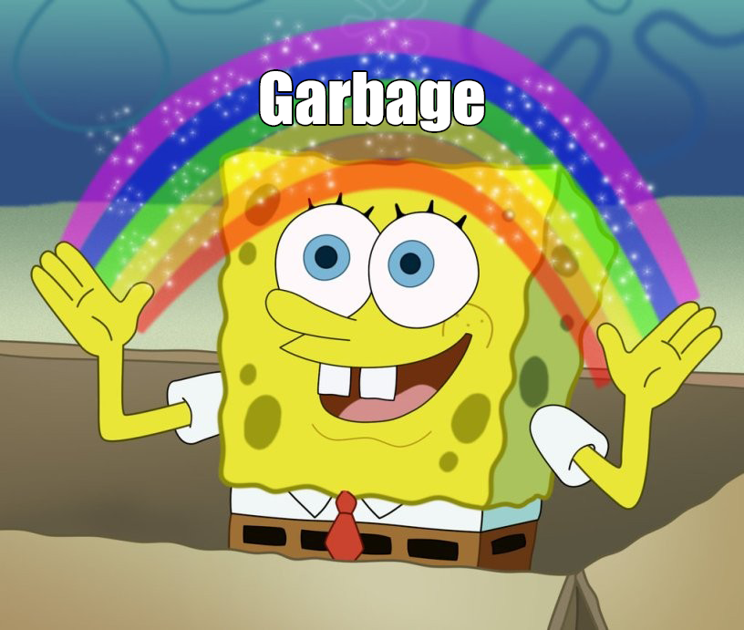

# A Waste Collection Problem with Service Type Option
Paper by Sina Gläser  
Presentation by Luuk van Nes  
Summary by Simon van Hus (6147879)

---

This paper presented a slightly novel scheduling problem around waste collection.
The main idea was that waste collection could be done in one of two "service types" options.
Either the collection service would pickup bins from the side or the road, or households would bring their waste to central collection points (from which the collection service would then pick them up).
The author of the paper describes this problem as a integer linear programming (ILP) problem with 24 constraints, however then proceeds to solve the problem using local search.

To be precise, they use adaptive large neighbourhood search, to deal with the large number of variables/constraints.
They choose a random route as a starting point, and then repeatedly use neighbourhood change operators -- functions that change the current solution in some way -- to find new alternatives.
The paper describes 5 main operations that they perform on the neighbourhood, but with different parameters this blows up to 43 total possible operators.
Only four of these operators are actually novel.
The operators are selected randomly but they are weighted on their previous performance.

Because the operators are all partially randomized, it is quite likely that the application of an operator actually worsens the solution.
However, accepting only better solutions will likely cause the current solution to become stuck in a local optimum.
To combat this, the author implements simulated annealing.

Due to the two service types offered in this version of the problem, the author notes that it can't be directly compared to other papers on garbage collection problem.
They do however compare it to a linear programming approach, which it either equals or does better than.
However, due to the slow nature of linear programming, these comparisons are only done on small instances.
They do also compare it to another algorithm, by simplifying the problem so both algorithms can handle the problem, and the paper's algorithm wins the comparison -- however this probably due having access to more operators.
All with all, the algorithm seems to perform decently well, however there is seemingly no fair way to compare it to its peers.

 
